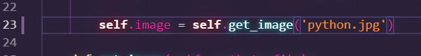

# Matrix Image

## About project
The project is inspired by the film Matrix and a Youtube video by Standalone Coder. Substituting any image you can get its version from the MATRIX.

## How to use?
1. Download pygame and numpy packages from requieremnts.txt
2. Specify the path to the photo in line 23 (Matrix_image.py) 
3. Run the Matrix_image.py file
