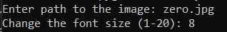

# Matrix Image

## About project
The project is inspired by the film Matrix and a Youtube video by *Standalone Coder* (~~And sprinkled with my deep dark fantasies~~). Substituting any image you can get its version from the **MATRIX**.

## Usage just got easier! (Finally)
1. Download the zip archive and unpack it wherever convenient.
2. Open the console and install the packages from **requierements.txt** with the command: `pip install -r requirements.txt`
3. Now with the command `python matrix_im.py` run the program. At startup, you need to specify the path to the image and the desired size of characters (If you do not understand what I mean, try entering values ​​from *1 to 20*, you will immediately notice the differences)

## Changes, people, changes!:
1. Now this piece of .... code interacts with the user! Image and character size can be selected.This console crap is a temporary measure. Do not worry))

    

2. Now the window is resized to fit the image. no more stretched **Untranslatable Russian word** ~~ЕБАЛЬНИКОВ~~
3. Several annoying functions were moved to a separate file
4. You can see that the symbols that make up the image are not random and are individual for each of them. (In fact, there is no smart one, the symbols are taken from the name of the image itself)
5. Well, I wrote some comments so that in a year I wouldn’t be fucking crazy about my genius.

## TODO: 
1. ~~Optimize this shit~~ (I am looking towards using the **numba** module in some functions)
2. Now user interaction is implemented through input () and it looks like a piece of shit. In the future, I will wrap the interective in convenient windows (~~Another year later~~)
3. Now the problem with not quite correct color rendition is obvious. I'm working on this too.
