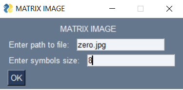

# **Matrix Image**

## **About project**
The project is based on the repository of the excellent developer [Standalone Coder](https://github.com/StanislavPetrovV)

The project is inspired by the film Matrix and a Youtube video by *Standalone Coder* (~~And sprinkled with my deep dark fantasies~~). Substituting any image you can get its version from the **MATRIX**.

### You can take a look at the examples in the **Examples** folder.

## Usage just got easier! (Finally)
1. Download the zip archive and unpack it wherever convenient.
2. Open the console and install the packages from **requierements.txt** with the command: `pip install -r requirements.txt`
3. Now with the command `python matrix_im.py` run the program. At startup, you need to specify the path to the image and the desired size of characters (If you do not understand what I mean, try entering values ​​from *1 to 20*, you will immediately notice the differences).Also, now you can choose the symbols for display yourself (optionally, see updates from 09/30/21)

## **Changes, people, changes!:**
### **--------------24.01.22--------------**
3:48 PM... OOOok This was not included in the plans, but now you can change colors! A separate column has been added to the main settings window. There are only three colors so far (red, green, blue). What are you looking at? I'm working on it...

### **--------------24.01.22--------------**
In less than a couple of days, I added even more symbol flags. The full list will be below.

1. ascii - '!"#$%&()*+,-./'
2. digit - '0123456789'
3. arrow - '-><-'
4. bucks - '$$$'
5. author - 'godovorez'
6. uwu - '(UwU)'

### **--------------21.01.22--------------**
Hi guys. Procrastination is finally subdued, and I sat down to finish my business here. Let's get down to business, I added the ability to select a specific character set in the main settings window. I think pictures will make it clearer.

1.There are only two of them so far, but this is only the beginning, right? (I hope)

"ascii" - Use standard ascii characters (!"#$%&()*+,-./)

"digit" - Only numbers

### **--------------07.11.21--------------**

1. I've been worried about the problem in the im_contrast function for a long time. It improved the brightness of the image, but at the same time it simply destroyed the dark areas. I have corrected this misunderstanding.

2. Minor edits

### **--------------30.09.21--------------**

1. So here it is necessary to clarify. The ability to select symbols for the final display has been added. You can see this in the dialog box (A new input field has appeared). It works like this. If you entered your characters in this field for display, they will be used, if you did not enter, then as before, the characters are taken from the file name. It's simple. If a little confusing, you can play with this field and understand what I mean.

2. Minor edits made (contrast adjusted, docstrings updated)
### **--------------26.09.21--------------**

1. I promised to work on the color rendition. It turned out to be easier than I thought! By increasing the contrast of the image, it becomes brighter and richer

2. I worked on the Docstrings, increased the readability of the code, made minor edits and that's it.
### **--------------14.09.21--------------**

1. Added logging.While working through the ~~dog's pussy~~, but this is fixable.

2. Little fixes... Well, you get the idea.
### **--------------13.09.21--------------**

1. Finally, a convenient window for selecting a file and parameters has been added. Goodbye console.(Actually, no, the program itself is still run through the console)
    
    

2. The functions responsible for the parameters window have been moved to a separate file for obvious reasons. They have nothing to do in the main file.

    

3. And other minor changes ~~that everyone doesn't give a fuck about~~ (if you're interested, check the commit history)
### **--------------11.09.21--------------**

1. It happened! Now the program will automatically convert the file to the required format
2. Also some minor edits were made. Docstring, typings and other nonsense that nobody cares about
### **--------------31.08.21--------------**

1. ~~Now this piece of .... code interacts with the user! Image and character size can be selected.This console crap is a temporary measure. Do not worry))~~ (**Fixed 09.13.21**)

2. Now the window is resized to fit the image. No more stretched **Untranslatable Russian word** ~~ЕБАЛЬНИКОВ~~
3. Several annoying functions were moved to a separate file
4. You can see that the symbols that make up the image are not random and are individual for each of them. (In fact, there is no smart one, the symbols are taken from the name of the image itself)
5. Well, I wrote some comments so that in a year I wouldn’t be fucking crazy about my genius.

## TODO: 
1. ~~Add the ability to change the base color~~
2. ~~Optimize this shit (I am looking towards using the **numba** module in some functions)~~
3. ~~Now the problem with not quite correct color rendition is obvious. I'm working on this too.~~
